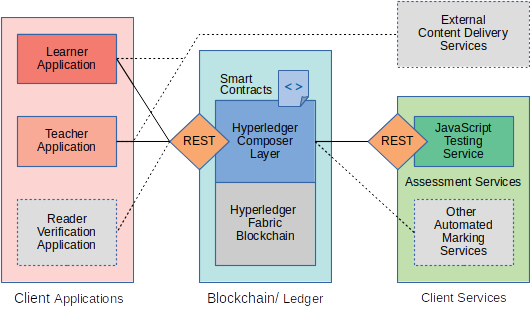

# bcu

Blockchain University is a proof-of-concept e-Learning platform built on the 
[Hyperledger Composer framework](https://github.com/hyperledger/composer) 
for a public permissioned blockchain.

It fulfils educational assessments and personalised curricula with smart contracts. 
It has the potential to improve several core learning experiences, such as assessments, 
curriculum personalisation, and learner privacy.

Components built:
- Blockchain network schema (Hyperledger Composer deployment definitions)
- Learner's Client Application (Vue.js web app)
- Teacher's Client Application (Vue.js web app)
- Example Automated Marking Server (Express.js web app)