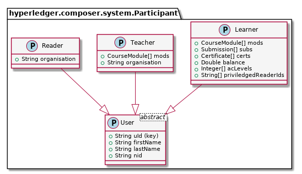
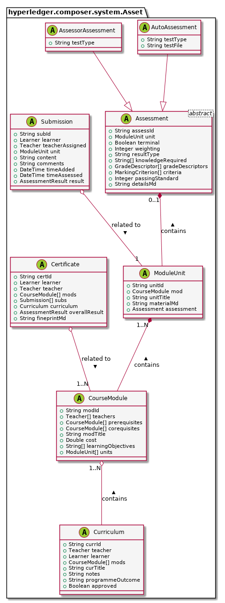

# bcu (blockchain university)
The blockchain definitions are written on Hyperledger Composer v0.16.X and 
should be deployed to Hyperledger Fabric v1.0

It is recommended to run this as a local development instance on Linux OS, 
see the installations guide here:
https://hyperledger.github.io/composer/v0.16/installing/development-tools.html
Newer versions of Hyperledger Composer and Fabric contain breaking changes, 
so do make sure you pull the right packages by specifying versions, eg: 

```
    npm install -g composer-cli@0.16.6
    docker pull hyperledger/composer-cli:0.16.6
```

<!-- If this is your first time setting it up, go to your Hyperledger Fabric installation directory and run:
```
    ./createPeerAdminCard.sh 
```
This will create your netw -->

To start this blockchain network on Fabric and create the blockchain peers:

```
cd <your-clone-directory>/moocon-beta/
./start.sh
```

Then, authorise your machine as a user for the API at http://localhost:3000/explorer
You will need a GitHub account for this (https://github.com/join)
Go to http://localhost:3000/auth/github which will login and authorise through GitHub.
You will be then given a access token after the login redirection. 
Copy this access token string, and paste it in the following three files:
```
<your-clone-directory>/moocon-beta/newman/moocon_envir_vars.json
<your-clone-directory>/client-learners/src/main.js
<your-clone-directory>/client-teachers/src/main.js
```
You will find the appropriate locations to paste your token by searching for "REPLACE" in the code.

Next, import the participant login cards, and the example course data:

```
cd <your-clone-directory>/moocon-beta/newman
newman run import_cards.json -e moocon_envir_vars.json
newman run import_courses.json -e moocon_envir_vars.json
```

To stop this blockchain network and clean-up (essential or your next runs would not work):

```
cd {to your-clone-directory}
./destroy.sh
```

### This peer network defines:

**Participants**
`Learner`
`Teacher`
`Reader`



**Assets**
`Curriculum`
`CourseModule`
`ModuleUnit`
`Assessment`
`Submission`
`Certificate`

See bottom for class diagram of assets.

**Transactions**
`CreateModule`
`AddSubmission`
`SubmitResult`
`ProposeCurriculum`
`ApproveCurriculum`
`SignCertificate`

**Events**
`SubmissionUploaded`
`ResultAvailable`
`CourseModuleCompleted`
`NewCertificate`
`CurriculumProposed`
`CurriculumApproved`
`BalanceChanges`

### Other helpful commands:

```
# starting the rest server as admin
composer-rest-server -c admin@moocon-beta -n always -w true

# regen the .bna
composer archive create -t dir -n .

# update the .bna used when the blockchain is already running
composer network update -c admin@moocon-beta -a moocon-beta@0.1.3.bna

# debug events emitted on websockets
wscat -c localhost:3000
```


